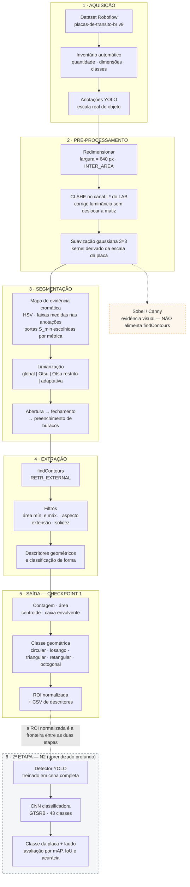

# Arquitetura da solução

Fluxo de dados da imagem de entrada até a saída pretendida, indicando o ponto em que o
modelo de IA entra nas próximas etapas do projeto.

A versão renderizada em imagem, com os valores de parâmetro da última execução, é gerada
pela Seção 9 do notebook em [`arquitetura_pipeline.png`](arquitetura_pipeline.png).

---

## Diagrama

---

## O ponto de entrada da IA

A fronteira entre as duas etapas é a **ROI normalizada**.

O Checkpoint 1 entrega o recorte da região de interesse acompanhado de seus descritores
geométricos. É exatamente esse recorte que a 2ª Etapa consome — e o pipeline clássico não é
descartado quando o modelo treinado entra: ele permanece em três papéis.

| Papel na N2 | Componente reaproveitado |
|---|---|
| Pré-processamento do detector | Redimensionamento e correção de iluminação (CLAHE) |
| Pós-processamento das caixas propostas | Filtro por área mínima e descritores geométricos |
| Linha de base comparativa | Contagem e classificação clássicas, medidas com a mesma métrica |

Esse terceiro papel é o que dá sentido quantitativo à 2ª Etapa: o ganho do detector treinado
é medido **contra os números produzidos aqui**, e não contra uma expectativa.

---

## Decisões de arquitetura que o diagrama registra

**A cor é convertida em um canal escalar antes da limiarização.** Em vez de aplicar máscaras
binárias por faixa de HSV — que exigem bordas rígidas e produzem resultado frágil —, o
pipeline constrói um mapa contínuo de "quanto este pixel se parece com uma placa" e deixa a
decisão de corte para a limiarização, que enxerga a distribuição inteira da imagem.

**A morfologia vem antes dos contornos, e o fechamento é a operação crítica.** Uma placa de
regulamentação é uma orla colorida em torno de um miolo branco: o mapa cromático enxerga o
anel, não o disco. Sem o fechamento dimensionado pela escala real do objeto, `findContours`
devolveria um anel fino, com área e centroide errados.

**O Canny é um ramo lateral, não parte do fluxo principal.** Uma borda fechada de um pixel
tem dois lados: alimentar `findContours` com ela produz um contorno externo e outro interno
para o mesmo objeto e duplica a contagem. A extração parte sempre da máscara morfológica
preenchida.

**As faixas de cor são medidas nas anotações, não fixadas à mão.** A norma fornece apenas as
âncoras (vermelho, amarelo, verde, azul). A Seção 5.0 do notebook mede a matiz dominante de
cada classe anotada, agrupa as classes em torno dessas âncoras e recalcula o centro e a largura
de cada faixa a partir do que observou. Uma âncora sem objetos suficientes não vira faixa. Em
seguida, o estágio 0 da busca em grade escolhe a porta de saturação de cada faixa por descida
em coordenadas, e pode descartar uma faixa inteira quando ela custa mais em falsos positivos do
que rende em detecções. Foi a falta desse passo que, numa versão anterior, manteve no pipeline
uma faixa azul sem alvo, cuja única captura era o céu.

**A filtragem por escala tem duas pontas, não uma.** O piso de área remove ruído residual; o
teto remove fachadas, toldos e maciços de vegetação fotografados de perto, que passam pelos
filtros de forma por serem convexos e de proporção compatível. Ambos os limites vêm da
distribuição de áreas anotadas, medida na Seção 2.1 do notebook, e o estágio 2 da busca mede
se o teto ainda ajuda depois que a faixa azul saiu; "sem teto" é um resultado legítimo.
