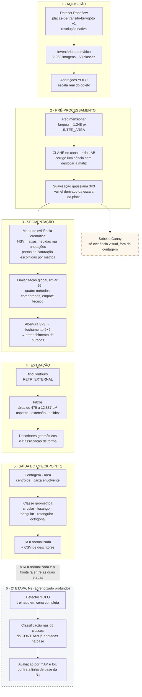

# Arquitetura da solução

Fluxo de dados da imagem de entrada até a saída, com o ponto em que o modelo de IA entra na
2ª Etapa do projeto.

A versão em imagem, com os valores de parâmetro da última execução, é gerada pela Seção 9 do
notebook em [`arquitetura_pipeline.png`](arquitetura_pipeline.png).

---

## Diagrama

```mermaid
flowchart TD
    subgraph AQ["1 · AQUISIÇÃO"]
        A1["Dataset Roboflow<br/>placas-de-transito-br-wq5tp v1<br/>resolução nativa"]
        A2["Inventário automático<br/>2.963 imagens · 68 classes"]
        A3["Anotações YOLO<br/>escala real do objeto"]
        A1 --> A2 --> A3
    end

    subgraph PRE["2 · PRÉ-PROCESSAMENTO"]
        B1["Redimensionar<br/>largura = 1.248 px · INTER_AREA"]
        B2["CLAHE no canal L* do LAB<br/>corrige luminância sem deslocar a matiz"]
        B3["Suavização gaussiana 3×3<br/>kernel derivado da escala da placa"]
        B1 --> B2 --> B3
    end

    subgraph SEG["3 · SEGMENTAÇÃO"]
        C1["Mapa de evidência cromática<br/>HSV · faixas medidas nas anotações<br/>portas de saturação escolhidas por métrica"]
        C2["Limiarização global, limiar = 96<br/>quatro métodos comparados, empate técnico"]
        C3["Abertura 3×3 → fechamento 9×9<br/>→ preenchimento de buracos"]
        C1 --> C2 --> C3
    end

    subgraph EXT["4 · EXTRAÇÃO"]
        D1["findContours<br/>RETR_EXTERNAL"]
        D2["Filtros<br/>área de 479 a 12.887 px²<br/>aspecto · extensão · solidez"]
        D3["Descritores geométricos<br/>e classificação de forma"]
        D1 --> D2 --> D3
    end

    subgraph OUT["5 · SAÍDA DO CHECKPOINT 1"]
        E1["Contagem · área<br/>centroide · caixa envolvente"]
        E2["Classe geométrica<br/>circular · losango · triangular · retangular · octogonal"]
        E3["ROI normalizada<br/>+ CSV de descritores"]
        E1 --> E2 --> E3
    end

    subgraph N2["6 · 2ª ETAPA, N2 (aprendizado profundo)"]
        F1["Detector YOLO<br/>treinado em cena completa"]
        F2["Classificação nas 68 classes<br/>do CONTRAN já anotadas na base"]
        F3["Avaliação por mAP e IoU<br/>contra a linha de base da N1"]
        F1 --> F2 --> F3
    end

    CANNY["Sobel e Canny<br/>só evidência visual, fora da contagem"]

    A3 --> B1
    B3 --> C1
    C3 --> D1
    D3 --> E1
    E3 -.->|"a ROI normalizada é a fronteira entre as duas etapas"| F1
    B3 -.-> CANNY

    style N2 fill:#f4f6f7,stroke:#5a6b7b,stroke-dasharray: 5 5
    style CANNY fill:#fdf6ec,stroke:#e08214,stroke-dasharray: 3 3
```

---

## Onde a IA entra

A fronteira entre as duas etapas é a **ROI normalizada**. O Checkpoint 1 entrega o recorte da
região de interesse com os seus descritores geométricos, e é esse recorte que a 2ª Etapa
consome.

O pipeline clássico não é descartado quando o modelo treinado entra. Ele continua em três
papéis:

| Papel na 2ª Etapa | O que é reaproveitado |
|---|---|
| Pré-processamento do detector | Redimensionamento e correção de iluminação (CLAHE) |
| Pós-processamento das caixas propostas | Filtro por área e descritores geométricos |
| Linha de base | Os números desta etapa, medidos com o mesmo protocolo |

O terceiro papel é o que dá medida à 2ª Etapa: o ganho do modelo treinado vai ser comparado
com os números produzidos aqui, e não com uma expectativa.

---

## Decisões que o diagrama registra

**A cor vira um canal contínuo antes da limiarização.** Em vez de recortar faixas de HSV com
bordas rígidas, o pipeline calcula para cada pixel o quanto ele se parece com a cor de uma
placa, de 0 a 255. A decisão de corte fica com a limiarização, que olha a imagem inteira.

**O método de limiarização saiu de uma comparação.** Global, Otsu, Otsu restrito e adaptativa
foram medidos na mesma amostra de ajuste e empataram dentro de 0,005 de F1. A regra de
desempate, definida antes de rodar, é ficar com o mais simples: por isso o global, com limiar
96. O limiar T de Otsu de cada imagem continua sendo calculado, só como diagnóstico de
iluminação.

**O fechamento é a operação crítica da morfologia.** A placa de regulamentação é uma orla
vermelha em volta de um miolo branco, e o mapa de cor enxerga o anel, não o disco. Sem o
fechamento, dimensionado pelo tamanho real das placas, o `findContours` devolveria um anel
fino, com área e centroide errados.

**Sobel e Canny ficam num ramo lateral.** Uma borda fechada de um pixel tem dois lados, e o
`findContours` encontraria um contorno por dentro e outro por fora do mesmo objeto, dobrando a
contagem. Os contornos saem sempre da máscara morfológica preenchida.

**As faixas de cor são medidas, não fixadas à mão.** A norma dá só as âncoras (vermelho,
amarelo, verde e azul). A Seção 5.0 do notebook mede a matiz das placas anotadas, forma as
faixas em torno das âncoras e descarta as que não têm placas suficientes, como o verde. Depois,
a busca em grade escolhe a porta de saturação de cada faixa e pode descartar uma faixa inteira;
foi o que aconteceu com o azul, que capturava céu e quase nenhuma placa.

**O filtro de área tem duas pontas.** O mínimo remove ruído; o máximo remove fachada, toldo e
vegetação fotografados de perto, que passam pelos filtros de forma por serem convexos. Os dois
saem da distribuição de áreas das placas anotadas.
